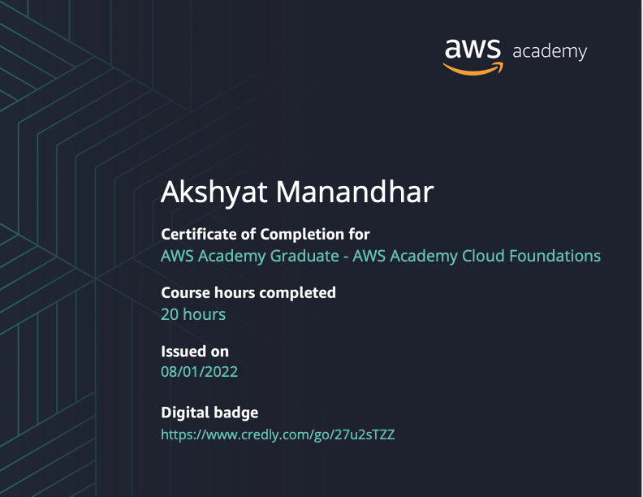
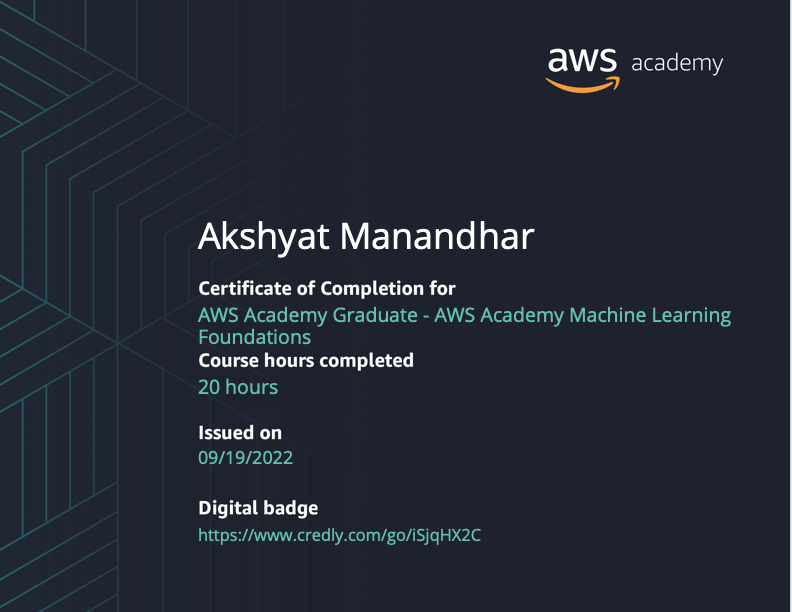
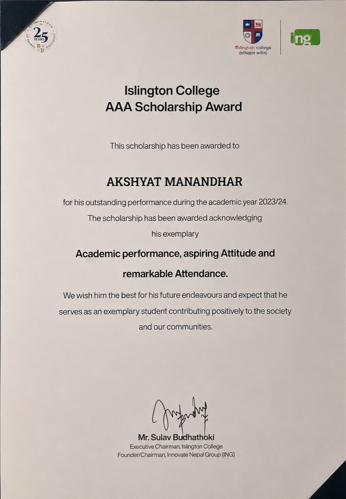
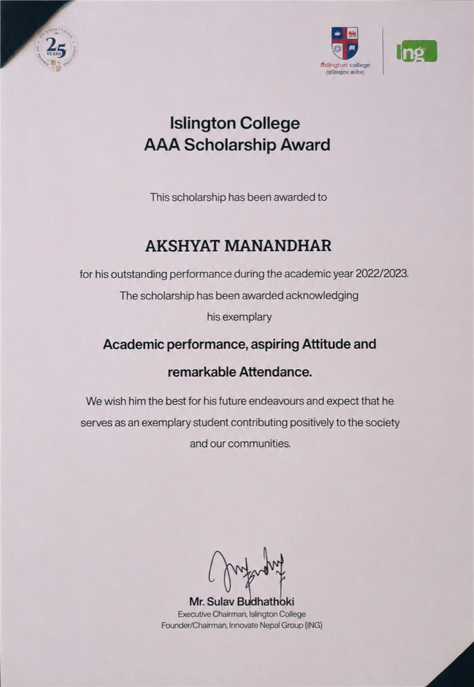

<p align="center">
  
</p>

<p align="center">
  <a href="mailto:manandharakshyat@gmail.com"></a>
  <a href="https://github.com/AkshyatMan"></a>
  <a href="https://www.linkedin.com/in/akshyat-manandhar/"></a>
  
</p>


## 🧑‍💻 About Me

<details open>
<summary><b>Click to expand / collapse</b></summary>

<br />

- 🔭 Currently building full-stack products with **React**, **React Native**, **Node.js** and **Go**
- 💻 Comfortable across the whole stack — web frontend, mobile apps, backend APIs and services
- 👯 Open to collaborating on **web & mobile projects**
- 💬 Ask me about **React, React Native, Node.js or Go**
- 📫 Reach me at **<manandharakshyat@gmail.com>**
- ⚡ Fun fact: **I write Go by day, React by night, and dream in TypeScript interfaces**

```json
{
  "name": "Akshyat Manandhar",
  "role": "Fullstack Developer",
  "stack": ["React", "React Native", "Node.js", "Go"],
  "currently_learning": ["System Design", "Distributed Systems"],
  "fun_fact": "I write Go by day, React by night, and dream in TypeScript interfaces"
}
```

</details>


## 🛠️ Tech Stack

<p align="center"><b>Languages</b></p>
<p align="center">
  
</p>

<p align="center"><b>Frontend &amp; Mobile</b></p>
<p align="center">
  
</p>

<p align="center"><b>Backend, Data &amp; DevOps</b></p>
<p align="center">
  
</p>


## 🚀 Featured Projects

<table align="center">
  <tr>
    <td width="50%" valign="top">
      <h3 align="center">Otech</h3>
      <p align="center">
        <a href="https://otech-three.vercel.app" target="_blank">
          
        </a>
        <a href="https://github.com/AkshyatMan/Otech">
          
        </a>
      </p>
      <p align="center">
        
      </p>
      <p align="center">Tech company website built in TypeScript, deployed on Vercel.</p>
    </td>
    <td width="50%" valign="top">
      <h3 align="center">Heirloom</h3>
      <p align="center">
        <a href="https://heirloomweb.vercel.app/" target="_blank">
          
        </a>
      </p>
      <p align="center">
        
      </p>
      <!-- <p align="center">
        <a href="https://github.com/AkshyatMan/SalonBuddy">
          
        </a>
      </p> -->
      <p align="center">Full barber shop management system — React Native Expo, React for frontend, Nodejs backend, PostgreSQL for database.</p>
    </td>
  </tr>
  <tr>
    <td width="50%" valign="top">
      <h3 align="center">DHN Landing Page</h3>
      <p align="center">
        <a href="https://dhn-zsck.vercel.app/">
          
        </a>
      </p>
      <p align="center">
        
      </p>
      <p align="center">Natural History Museum.</p>
    </td>
    <td width="50%" valign="top">
      <h3 align="center">Lumora Landing Page</h3>
      <p align="center">
        <a href="https://lumoraindex.vercel.app/">
          
        </a>
      </p>
      <p align="center">
        
      </p>
      <p align="center">Interactive Landing Page with changing backgrounds.</p>
    </td>
  </tr>
</table>


## 📊 GitHub Stats

<p align="center">
  
  
</p>

<p align="center">
  
</p>


## 📜 Certificates

<p align="center">
  <a href="https://www.credly.com/go/27u2sTZZ"></a>
  <a href="https://www.credly.com/go/iSjqHX2C"></a>
  
</p>

<br/>

**AWS Academy Graduate — Cloud Foundations** · 20 hours · Issued 08/01/2022 · [Verify on Credly](https://www.credly.com/go/27u2sTZZ)

<p align="center">
  
</p>

**AWS Academy Graduate — Machine Learning Foundations** · 20 hours · Issued 09/19/2022 · [Verify on Credly](https://www.credly.com/go/iSjqHX2C)

<p align="center">
  
</p>

**Islington College — AAA Scholarship Award 2023/24** · Academic performance, aspiring attitude, remarkable attendance

<p align="center">
  
</p>

**Islington College — AAA Scholarship Award 2022/23** · Academic performance, aspiring attitude, remarkable attendance

<p align="center">
  
</p>


## 🐍 Contribution Snake

<p align="center">
  <picture>
    <source media="(prefers-color-scheme: dark)" srcset="https://raw.githubusercontent.com/AkshyatMan/AkshyatMan/output/github-contribution-grid-snake-dark.svg" />
    <source media="(prefers-color-scheme: light)" srcset="https://raw.githubusercontent.com/AkshyatMan/AkshyatMan/output/github-contribution-grid-snake.svg" />
    
  </picture>
</p>


## 😄 Dev Joke

<p align="center">
  
</p>


## 🙏 Thanks for Visiting!

<p align="center">
  
</p>

<p align="center"><i>"Code is like humor. When you have to explain it, it's bad." — Cory House</i></p>


